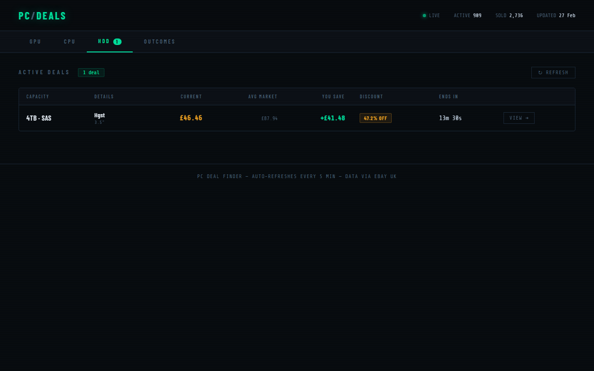
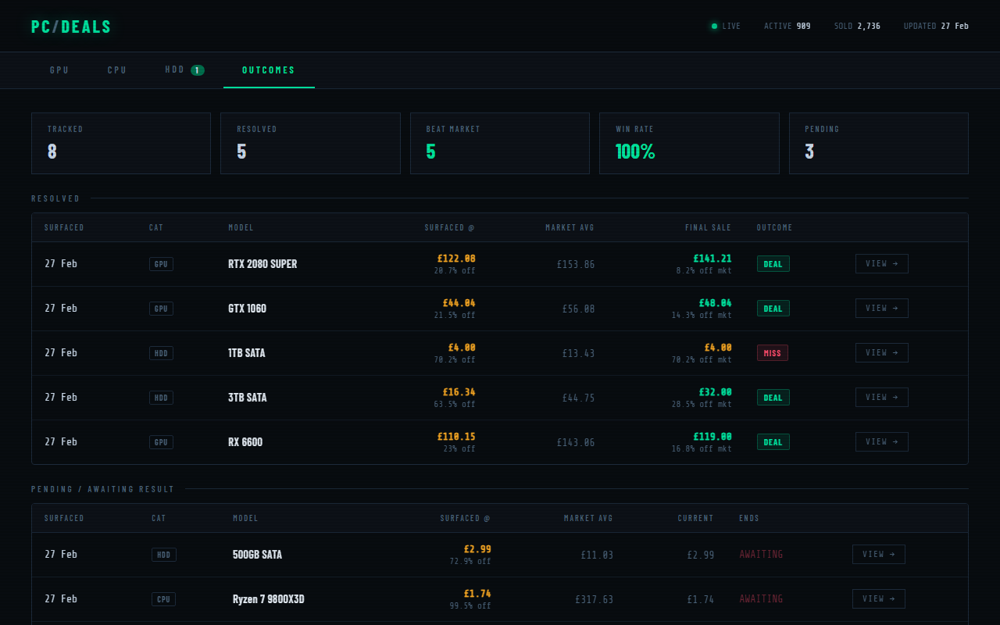

# PC Deal Finder

Scrapes eBay UK for used GPU, CPU, and Hard Drive auctions, compares current bids against historical sold prices, and surfaces deals ending within 2 hours that are **20%+ below market rate** — with live countdown timers and outcome tracking to validate the algorithm.

---

## Screenshots

### Deal Dashboard — HDD tab showing a live deal


### Outcomes — resolved deals with DEAL / MISS verdict and win rate


### Mobile — responsive card layout


---

## Features

### Deal Detection
- Surfaces auctions ending **within 2 hours** priced **≥ 20% below** the average sold price for that model
- Minimum 5 historical sold listings required before a model's average is trusted
- Deals ranked by **potential gain** (market avg − current price)
- Tab badges show active deal count at a glance; countdown timers update every second
- Items under **5 minutes** blink red

### Categories
| Tab | Coverage |
|-----|----------|
| **GPU** | NVIDIA GTX 900/1000, RTX 2000/3000/4000 · AMD RX 5000/6000/7000 |
| **CPU** | Intel Core i3/i5/i7/i9 · AMD Ryzen 3/5/7/9 |
| **HDD** | SATA & SAS hard drives (4–12 TB) |

### Outcomes Tracking
Every deal surfaced by the dashboard is automatically recorded. The **OUTCOMES** tab shows:
- **Stat cards**: total tracked, resolved, beat-market count, win rate %, pending
- **Resolved table**: surfaced price vs final sale price, actual discount vs market, DEAL / MISS verdict
- **Pending table**: live deals still awaiting a result with countdown

### Outcome Verification Scrape
After a configurable number of hours past the auction end time, the scheduler runs a targeted search for each unresolved outcome using the item's actual title. Catches cases where the regular full scrape missed the sold listing window. Self-heals any existing backlog on every run.

### Adaptive Scheduler
Replaces a fixed interval with smart frequency scaling:

| Time remaining on a tracked deal | Targeted scrape interval |
|-----------------------------------|--------------------------|
| > 60 min | covered by hourly full scrape |
| 15–60 min | every 15 min |
| 5–15 min | every 5 min |
| < 5 min | every 1 min |

Targeted scrapes reuse the established Akamai session — no extra bot-detection overhead.

### Scraper Reliability
- **curl-cffi** with `chrome120` TLS fingerprint as primary fetcher — mimics a real browser's TLS handshake to pass Akamai bot detection on Linux/Docker
- **Zyte API** as pay-per-use fallback (only charged when curl-cffi is blocked, ~$1.8/1k requests, no subscription)
- Warm-up request on each full scrape run to seed Akamai cookies before the main search queries

### Deployment
- Two Docker containers: `dealfinder-web` (Flask + Gunicorn) and `dealfinder-scraper` (scheduler)
- Single `docker-compose.yml` — Compose Manager compatible for **Unraid** one-click deployment
- `host.docker.internal` extra-host so containers reach a MariaDB instance running directly on Unraid

### UI Details
- Dark terminal aesthetic with scanline overlay, monospace font, and glowing green accents
- Sticky header with live **ACTIVE** / **SOLD** listing counts and last-updated date
- Auto-refreshes every 5 minutes; manual Refresh button per tab
- Mobile-responsive: table rows collapse into stacked cards on small screens

---

## How It Works

```
┌─────────────────────────────────────────────────────────────────────┐
│  scheduler.py  (runs every 60 min + adaptive targeted scrapes)      │
│                                                                     │
│  1. reset_direct_session()  — fresh curl-cffi session + warm-up    │
│  2. ScrapeAndUpload(GPU/CPU/HDD queries)                            │
│     └─ Scrape() → eBay search (sold + active) → parse → DB upsert  │
│  3. VerifyPendingOutcomes()  — resolve missed outcome records       │
│  4. run_targeted_scrapes()   — per-item scrapes for ending deals    │
└─────────────────────────────────────────────────────────────────────┘
                         │
                         ▼ MariaDB (Scraper database)
┌─────────────────────────────────────────────────────────────────────┐
│  App.py / Flask  (served via Gunicorn on port 5000)                 │
│                                                                     │
│  GET /                   → dashboard (Index.html)                  │
│  GET /api/deals?type=gpu │cpu│hdd  → active deals, records outcome │
│  GET /api/deal-counts    → badge counts for all tabs               │
│  GET /api/stats          → active/sold totals + last-updated date  │
│  GET /api/outcomes       → resolved + pending outcomes + summary   │
└─────────────────────────────────────────────────────────────────────┘
```

**Deal filter logic** (SQL `WITH ModelStats`):
- Build per-model average from sold listings with ≥ 5 data points
- Surface active auctions where `price < avg × 0.8` ending within 2 hours
- Order by `AvgPrice − CurrentPrice` descending (biggest absolute saving first)

---

## Database Schema

MariaDB `Scraper` database. Tables are created automatically at web-server startup where possible; the category tables below must be created once manually.

```sql
CREATE TABLE EBAY (
    ID       BIGINT      PRIMARY KEY,
    Title    VARCHAR(300),
    Price    INT,          -- pence
    Bids     INT,
    EndTime  DATETIME,
    SoldDate DATE,
    URL      VARCHAR(500)
);

CREATE TABLE GPU (
    ID     BIGINT PRIMARY KEY,
    Brand  VARCHAR(50),
    Model  VARCHAR(100),
    VRAM   INT,
    FOREIGN KEY (ID) REFERENCES EBAY(ID)
);

CREATE TABLE CPU (
    ID     BIGINT PRIMARY KEY,
    Brand  VARCHAR(50),
    Model  VARCHAR(100),
    Socket VARCHAR(20),
    Cores  INT,
    FOREIGN KEY (ID) REFERENCES EBAY(ID)
);

CREATE TABLE HDD (
    ID         BIGINT PRIMARY KEY,
    Brand      VARCHAR(50),
    CapacityGB INT,
    Interface  VARCHAR(10),
    FormFactor VARCHAR(10),
    RPM        INT,
    FOREIGN KEY (ID) REFERENCES EBAY(ID)
);

-- Created automatically by App.py on first run:
CREATE TABLE IF NOT EXISTS DealOutcomes (
    EbayID         BIGINT      PRIMARY KEY,
    Category       VARCHAR(10) NOT NULL,
    Model          VARCHAR(150),
    SurfacedPrice  INT         NOT NULL,   -- pence
    AvgMarketPrice INT         NOT NULL,   -- pence
    DiscountPct    FLOAT       NOT NULL,
    BidCount       INT         NOT NULL DEFAULT 0,
    EndTime        DATETIME    NOT NULL,
    SurfacedAt     DATETIME    NOT NULL DEFAULT CURRENT_TIMESTAMP
);
```

---

## Setup

### Prerequisites
- Python 3.11+
- MariaDB accessible from your host (or via Docker)
- (Optional) Zyte API key for proxy fallback — [sign up free](https://www.zyte.com/zyte-api/)

### 1. Clone & install

```bash
git clone https://github.com/camh000/dealfinder.git
cd dealfinder
pip install -r requirements.txt
```

### 2. Create credentials.env

```bash
cp credentials.env.example credentials.env
# then edit credentials.env with your values
```

```env
DB_USER=admin
DB_PASSWORD=yourpassword
DB_HOST=192.168.1.104
DB_PORT=3305
DB_NAME=Scraper

# Optional — pay-per-use fallback if curl-cffi is blocked
ZYTE_API_KEY=your_zyte_api_key_here

# Hours after auction end before targeted outcome verification (default: 6)
OUTCOME_VERIFY_HOURS=6

# Minutes between full query-list scrapes (default: 60)
FULL_SCRAPE_INTERVAL_MINUTES=60
```

### 3. Create database tables

Run the `CREATE TABLE` statements from the schema above against your MariaDB instance.

### 4. Run locally

```bash
# Terminal 1 — web dashboard
python App.py

# Terminal 2 — scraper + scheduler
python scheduler.py
```

Open `http://localhost:5000`

---

## Deploy on Unraid

Unraid supports Docker Compose via the **Compose Manager** plugin (Community Applications).

### 1. Place project files

Copy the project to your Unraid appdata path, e.g.:

```
/mnt/user/appdata/dealfinder/
```

### 2. Add `host.docker.internal` resolution

The containers need to reach a MariaDB instance running directly on Unraid. Add to `docker-compose.yml` under each service (already included):

```yaml
extra_hosts:
  - "host.docker.internal:host-gateway"
```

Then use `host.docker.internal` as `DB_HOST` in your `credentials.env`.

### 3. Build and start

```bash
cd /mnt/user/appdata/dealfinder
docker compose up -d --build
```

The dashboard is available at `http://YOUR_UNRAID_IP:5000`.

### Useful commands

```bash
# Live scraper logs
docker compose logs -f scraper

# Live web logs
docker compose logs -f web

# Rebuild after a code change
docker compose up -d --build
```

---

## Project Structure

```
├── EbayScraper.py       # Scraper, parser, DB upload, outcome verification
├── scheduler.py         # Adaptive scheduler — full + targeted scrapes
├── App.py               # Flask web server + REST API
├── templates/
│   └── Index.html       # Single-page dashboard (vanilla JS)
├── tests/
│   └── test_scraper.py  # 42 unit tests (pytest)
├── Dockerfile.web        # Web container (Gunicorn)
├── Dockerfile.scraper    # Scraper container (scheduler.py)
├── docker-compose.yml    # Orchestrates both containers
├── requirements.txt
├── credentials.env.example
└── docs/
    └── screenshots/      # README images
```

---

## Development

### Run tests

```bash
# Unit tests only (no network, no DB)
python -m pytest tests/ -m "not live" -v

# Live scrape tests (requires internet)
python -m pytest tests/ -m live -v
```

### Environment variables reference

| Variable | Default | Description |
|----------|---------|-------------|
| `DB_USER` | — | MariaDB username |
| `DB_PASSWORD` | — | MariaDB password |
| `DB_HOST` | — | MariaDB host (use `host.docker.internal` in Docker) |
| `DB_PORT` | `3305` | MariaDB port |
| `DB_NAME` | — | Database name (e.g. `Scraper`) |
| `ZYTE_API_KEY` | — | Zyte API key for proxy fallback (optional) |
| `OUTCOME_VERIFY_HOURS` | `6` | Hours after auction end before targeted outcome search |
| `FULL_SCRAPE_INTERVAL_MINUTES` | `60` | Minutes between full category scrapes |
