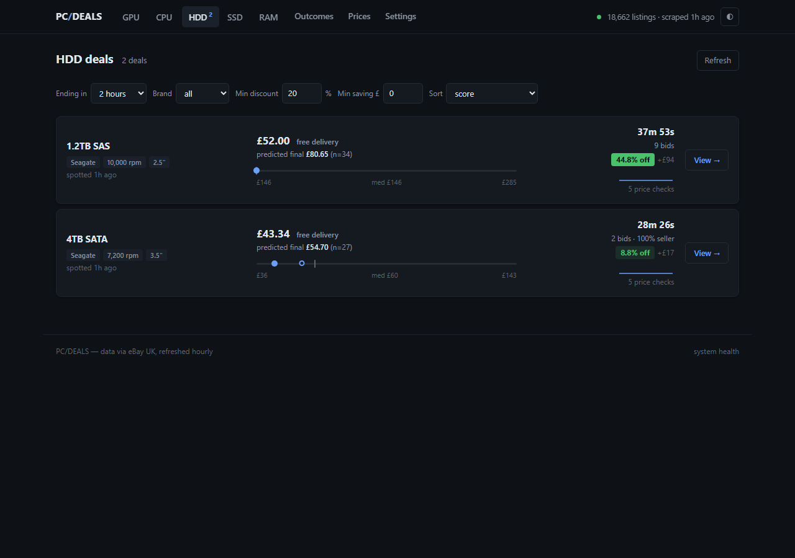
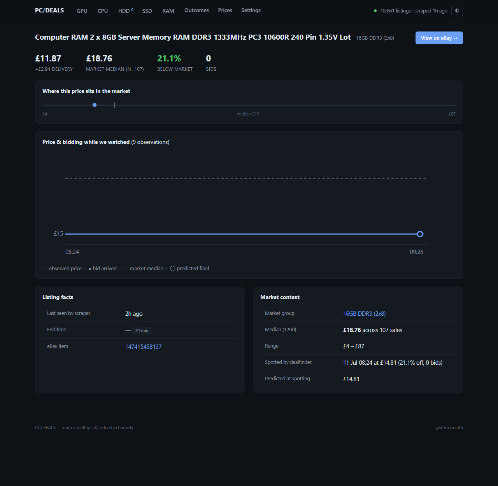
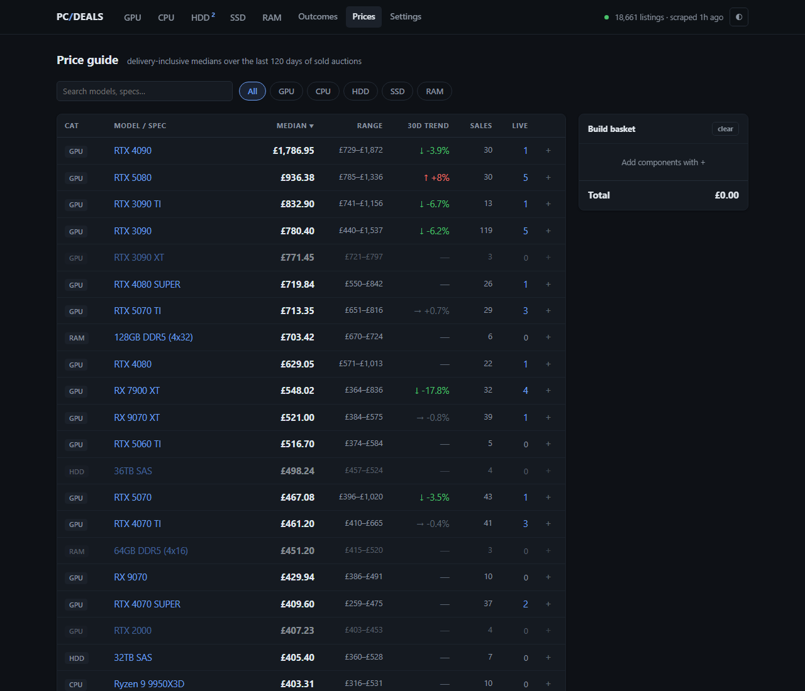
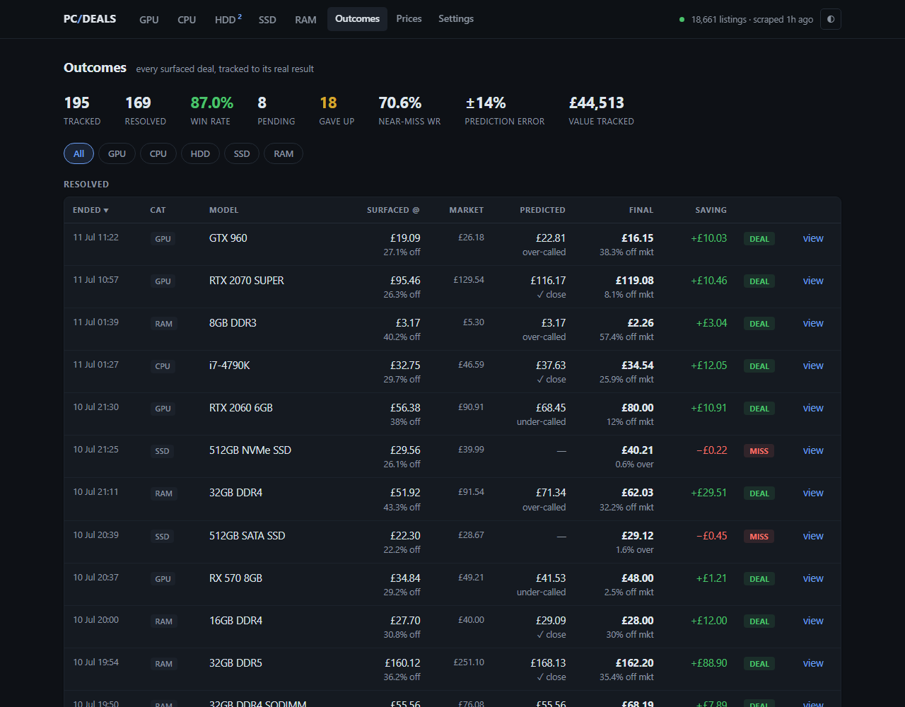
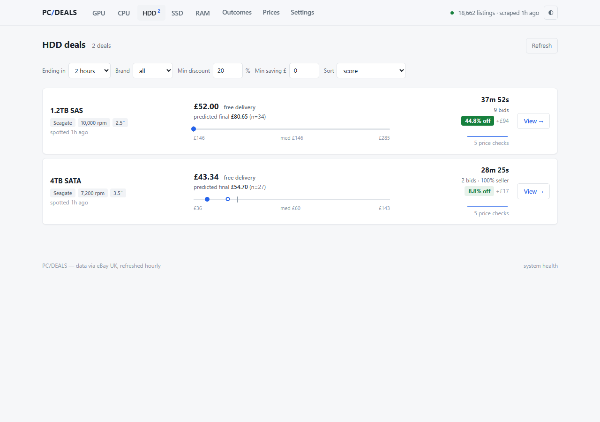
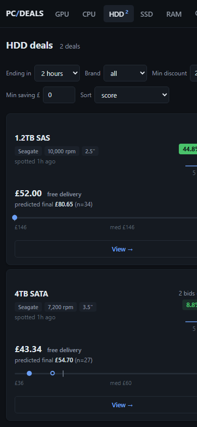

# PC Deal Finder

Scrapes eBay UK auctions for **GPUs, CPUs, HDDs, SSDs and RAM**, prices every
listing against honest market medians, predicts what each auction will
*actually* close at, and surfaces only the deals that survive every gate —
with push notifications, full outcome tracking, and a self-auditing
prediction model.

---

## Screenshots

### Deal feed — position bars, predicted finals, live sparklines


### Deal detail — everything known about one listing


### Price guide — 120-day medians, 30-day trends, live counts


### Outcomes — every surfaced deal tracked to its real result


### Light theme &amp; mobile
 

---

## How a deal earns its place

The full pipeline is documented in [docs/SURFACING.md](docs/SURFACING.md);
the short version — a listing must survive **six gates**:

1. **Seen**: appears on page 1 of one of ~45 hourly searches (sold + active).
2. **Not junk**: no damaged/untested/for-parts wording; not an accessory
   ("heatsink & box, no GPU") sold under the component's name.
3. **Parsed**: model/capacity/spec extracted; whole systems, combos and
   flash media filtered per category; job lots priced **per unit**.
4. **Comparable**: its market group has ≥5 single-unit sales in the last
   120 days. Market value is the delivery-inclusive **median**.
5. **A real discount**: ≥20% below median, from a seller with ≥90% feedback,
   seen alive by a scrape within 90 minutes, no unmet reserve.
6. **Predicted to stay a deal**: the outcome-calibrated snipe premium says
   the price *after the final bidding* still lands below market.

Newly surfaced deals get one **item-page enrichment fetch**: eBay's own
category (mislabelled accessories get delisted), structured condition
(unlabelled for-parts items delisted), reserve status, item location, ePID —
and the auction's **exact end timestamp**, so countdowns are second-accurate.

## Market honesty

Blended averages create phantom deals, so market groups split wherever the
data proved prices genuinely differ:

- **GPU**: model, with VRAM baked in for dual-memory variants
  (a 3060 12GB is not a 3060 8GB — £45 apart on real data)
- **HDD / SSD**: capacity + interface + internal/external
  (portable USB drives are their own market; SSDs split NVMe/SATA/USB)
- **RAM**: DDR type + kit capacity + DIMM/SODIMM + **kit composition**
  (2x8GB sold ~31% above 1x16GB at the same 16GB total)
- Medians use a **120-day window** (prices drift), single units only
  (lots excluded — bulk discounts are structural), and eBay's right-skew
  is handled by using the median, never the mean.

## The prediction model

Every resolved outcome teaches the system how far auctions climb from
"spotted" to "hammer" (per category × bid bucket). Live deals show a
**predicted final price**; the feed and notifications filter on the
*predicted* discount, not the current one. The model currently runs at
~±12% median error — and grades itself publicly on the Outcomes page.

Two experiments run continuously:

- a **near-miss control cohort** (12–20%-off listings, recorded but never
  surfaced) validates the 20% threshold;
- **DealSnapshots** records every tracked deal's price/bid trajectory
  (1–15 min cadence, plus one-shot scrapes at T−90s and T−25s against the
  exact end time) — the training data for time-aware premiums.

## Pages

| Route | What it shows |
|---|---|
| `/deals/<cat>` | The deal feed: position bars, predicted finals, freshness chips, sparklines |
| `/deal/<id>` | One listing in full: trajectory chart, enrichment facts, market context, outcome |
| `/prices` | Price guide: medians, ranges, 30-day trends, live counts, build basket |
| `/model/<cat>` | One market group: monthly median chart, recent sales, live auctions |
| `/outcomes` | Scoreboard: win rate, prediction error, near-miss cohort, resolved/pending |
| `/settings` | Theme, density, Home Assistant notification recipients |
| `/health` | Scrape freshness, per-field parse coverage, data volumes |

Dark + light themes (follows the system, manual override, `?theme=` link
override), comfortable/compact density, installable PWA.

## Architecture

```
┌──────────────────────────────────────────────────────────────────┐
│ scheduler.py — 10 s tick                                         │
│   hourly: full scrape (5 categories) → junk gate → parse →       │
│           upsert → outcome verification → SurfaceDeals           │
│           (record + enrich + notify) → prune → health stats      │
│   tiered: tracked deals re-scraped @15/5/1 min + T−90s/T−25s;    │
│           end times pinned to the second from item pages         │
└──────────────────────────────────────────────────────────────────┘
                    │ MariaDB (Scraper database)
┌──────────────────────────────────────────────────────────────────┐
│ App.py — Flask + Gunicorn (multi-page app + JSON API)            │
│   pages above + /api/deals /deal /outcomes /price-guide          │
│   /model-detail /snapshots /health /notify-settings              │
└──────────────────────────────────────────────────────────────────┘
```

Scraping uses **curl-cffi** with a Chrome TLS fingerprint (Zyte API as
pay-per-use fallback). A field-coverage canary watches per-field parse rates
and withholds the Uptime Kuma heartbeat when eBay's markup drifts — partial
parser blindness reads as "down" the same day.

## Storage

MariaDB, schema self-migrating (every column added since v1 auto-migrates
with `errno 1060` tolerance in both containers). Core tables: `EBAY`
(listings incl. shipping, quantity, seller feedback, exact end times,
reserve status, freshness stamp), per-category satellites (`GPU`, `CPU`,
`HDD`, `SSD`, `RAM`), `DealOutcomes` (the immutable first-sighting record +
resolution + enrichment facts), `DealSnapshots` (price/bid trajectories),
`ScrapeMeta` (health), `NotifyRecipients`.

## Setup

```bash
git clone https://github.com/camh000/dealfinder.git
cd dealfinder
pip install -r requirements.txt
cp credentials.env.example credentials.env   # then fill in
python App.py         # web (dev)  — production uses gunicorn
python scheduler.py   # scraper
```

All tunables live in [credentials.env.example](credentials.env.example) with
inline docs: DB credentials, Zyte key, scrape cadence, surfacing thresholds
(window/discount/near-miss band), prediction gates, market-stats window,
seller/freshness gates, HTTP Basic Auth, Kuma push URL, Home Assistant
notification settings.

### Deploy on Unraid

The repo is designed to be a git checkout at `/mnt/user/appdata/dealfinder`:

```bash
cd /mnt/user/appdata/dealfinder
git pull && docker compose up -d --build
```

Two containers (`dealfinder-web` on **:5010**, `dealfinder-scraper`),
`restart: always`, `host.docker.internal` for a MariaDB running on the host.

## Development

```bash
python -m pytest tests/ -m "not live"   # ~270 unit tests, no network/DB
python -m pytest tests/ -m live         # live scrape tests
```

Parser regression fixtures (real captured eBay pages — search results in
both markup generations, plus an item page) pin the scraper against markup
drift; refresh them per the docstring in `tests/test_fixture_parse.py`.

See [TODO.md](TODO.md) for the roadmap and
[docs/SURFACING.md](docs/SURFACING.md) for the full surfacing pipeline.
